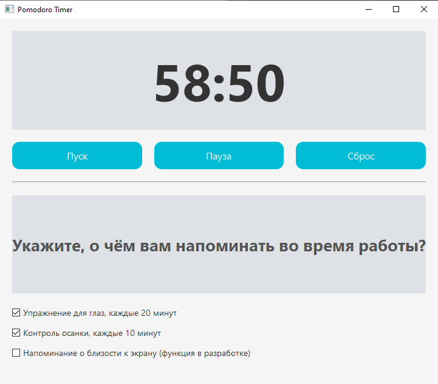

# Pomodoro Timer

## Описание

**Pomodoro Timer** — это простое и минималистичное приложение для управления временем, основанное на технике Pomodoro. Приложение помогает управлять рабочими интервалами и напоминает о перерывах для здоровья, таких как упражнения для глаз и контроль осанки. 

Проект является полностью открытым исходным кодом, и вы можете скачать исходные файлы или скомпилированную версию (архив с EXE-файлом).

## Особенности

- Таймер с периодами работы и отдыха (техника Pomodoro).
- Напоминания о необходимости сделать перерыв для глаз каждые 20 минут.
- Напоминания о необходимости контроля осанки каждые 10 минут.
- Возможность настроить автоматический запуск при старте системы.
- Простой и приятный интерфейс.

## Функциональные возможности

1. **Таймер Pomodoro:** Основная функция для управления рабочими интервалами и перерывами.
2. **Напоминания для здоровья:** Приложение предлагает напоминания об упражнениях для глаз и правильной осанке.
3. **Длительный перерыв:** После завершения сессии приложение предложит сделать длительный перерыв.
4. **Автозагрузка:** Приложение может быть настроено на автозапуск при включении компьютера.
5. **Создание ярлыков:** При установке создаются ярлыки на рабочем столе и в меню "Пуск".

## Как установить

1. Скачайте установочный файл, нажав [сюда](https://github.com/makwerik/TommatoTime/raw/refs/heads/master/setup.rar).
2. Распакуйте архив и запустите файл `setup.exe`.
3. Следуйте инструкциям установщика, выберите папку для установки и настройте ярлыки.
4. По завершении установки можно сразу запустить приложение.

## Исходный код

Исходный код полностью открыт и доступен для всех желающих. Вы можете скачать проект, изменять его или использовать в своих проектах. 

